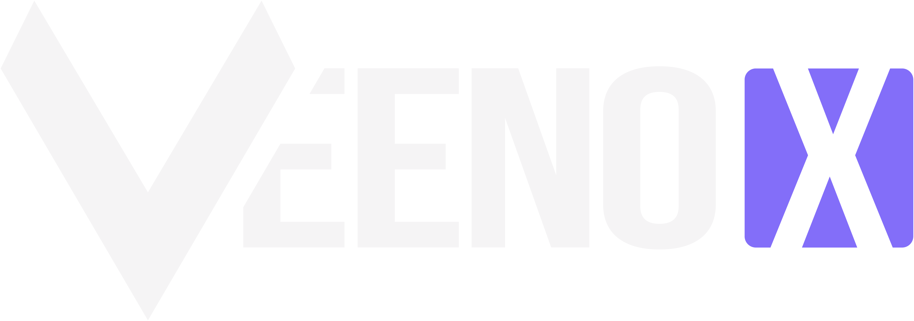

<br />
VeenoX is built using a modern tech stack comprising Next.js, Tailwind CSS, TypeScript and relies on npm for package management.
<br />
<br />

Check it out live: https://veeno-x.vercel.app/
<br />

## Getting Started with Development

You can follow these instructions to set up your environment and start contributing to Mobula.

## Installing Dependencies

To install the necessary dependencies, run the following command in your terminal:
<br />

```bash
npm install
```

This will fetch and install all the packages required to run Mobula locally.

## Running Locally

To start the development server, execute:
<br />

```bash
npm run dev
```

This will start the server on a local port, typically http://localhost:3000, where you can view and test your changes in real-time.
